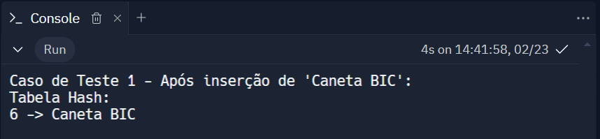
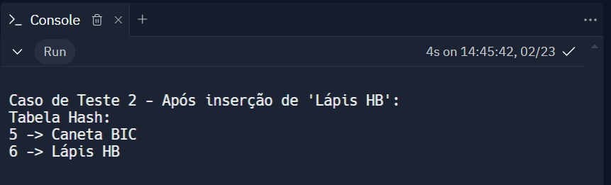
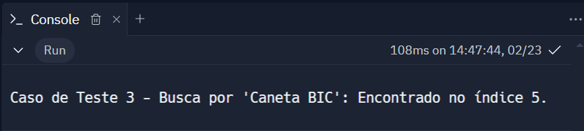
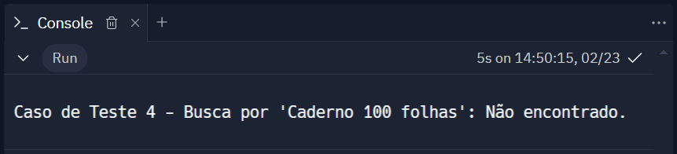
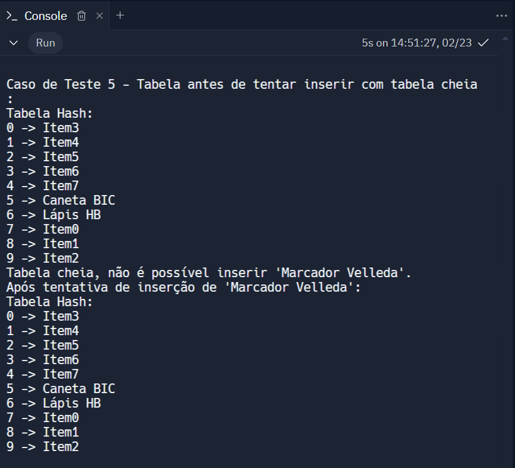

# Implementação da Tabela Hash

## Sumário

[1. Introdução](#c1)

[2. Casos de teste](#c2)

[3. Referências](#c3)

## 1. Introdução

&nbsp;&nbsp;&nbsp;&nbsp;Este projeto é uma implementação simplificada de uma tabela hash em C++. Elas são particularmente úteis para implementar dicionários e conjuntos.

&nbsp;&nbsp;&nbsp;&nbsp;O objetivo deste código é gerenciar um conjunto de mercadorias usando uma tabela hash. Cada mercadoria é representada por uma instância da classe Mercadoria, que armazena uma string representando o nome do item. A tabela hash é representada pela classe TabelaHash, que encapsula um vetor de objetos Mercadoria e oferece métodos para inserir uma nova mercadoria (inserir), buscar uma mercadoria pelo nome (busca) e imprimir todos os itens da tabela (imprimir).

&nbsp;&nbsp;&nbsp;&nbsp;A lógica de hash é simples: a soma dos valores dos caracteres ASCII do nome da mercadoria é calculada e então tomado o módulo dessa soma pelo tamanho da tabela para determinar o índice onde a mercadoria será armazenada. Isso é realizado na função funcaoHash. Se ocorrer uma colisão, ou seja, se o índice já estiver ocupado por outra mercadoria, a sondagem linear é aplicada: o programa tentará colocar o item no próximo índice disponível na tabela. Se a tabela estiver cheia, o código irá notificar que não é possível inserir a nova mercadoria.

&nbsp;&nbsp;&nbsp;&nbsp;O código também inclui uma função especial funcaoHash que garante que os nomes "Caneta BIC" e "Lápis HB" sempre colidam, para fins de teste e demonstração de como a tabela lida com colisões. Isso é feito retornando um valor fixo de hash para essas duas strings específicas.

## 2. Casos de teste

&nbsp;&nbsp;&nbsp;&nbsp;Aqui estão cinco casos de teste com pré-condições, etapas de teste e pós-condições:

### Testar a inserção sem colisões

- Pré-condição: A tabela hash está vazia.
- Etapas do teste: Inserir "Caneta BIC" na tabela.
- Pós-condição: "Caneta BIC" deve estar presente na tabela sem causar colisão.

Figura 1 - Caso de teste 1

Fonte: Material produzido pelo autor (2024)

### Testar a inserção com colisão

- Pré-condição: "Caneta BIC" está inserido na tabela e tem o mesmo valor hash que "Lápis HB".
- Etapas do teste: Inserir "Lápis HB" que deve causar colisão.
- Pós-condição: "Lápis HB" deve estar na tabela no próximo índice vazio após a colisão.

Figura 2 - Caso de teste 2

Fonte: Material produzido pelo autor (2024)

### Testar a busca por um item existente

- Pré-condição: "Caneta BIC" está inserido na tabela.
- Etapas do teste: Buscar por "Caneta BIC".
- Pós-condição: O índice de "Caneta BIC" deve ser retornado.

Figura 3 - Caso de teste 3

Fonte: Material produzido pelo autor (2024)

### Testar a busca por um item não existente

- Pré-condição: "Caderno 100 folhas" não está inserido na tabela.
- Etapas do teste: Buscar por "Caderno 100 folhas".
- Pós-condição: A função de busca deve retornar -1.

Figura 4 - Caso de teste 4

Fonte: Material produzido pelo autor (2024)

### Testar a tabela cheia e tentar inserir outro item

- Pré-condição: A tabela hash está cheia.
- Etapas do teste: Tentar inserir "Marcador Velleda".
- Pós-condição: Deve ser tratado o caso de tabela cheia e não inserir o novo item.

Figura 5 - Caso de teste 5

Fonte: Material produzido pelo autor (2024)

## 3. Referências

Como implementar uma TABELA HASH com vetor na prática? Disponível em: <https://wagnergaspar.com/como-implementar-uma-tabela-hash-com-vetor-na-pratica/>. Acesso em: 23 fev. 2024.

